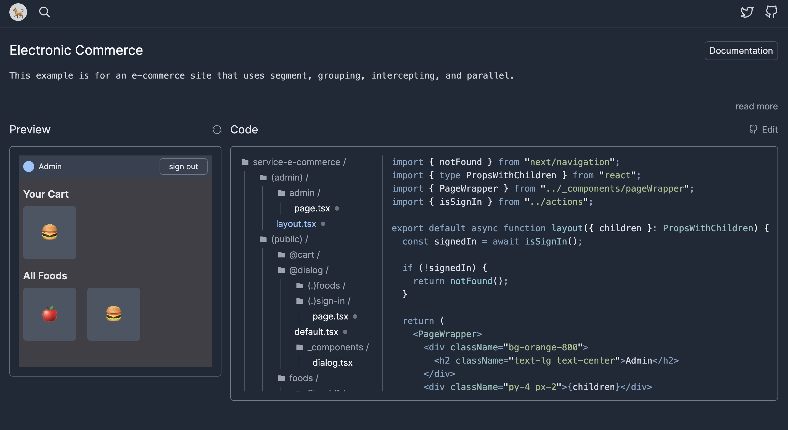

# Next.js App Router Training



[This site](https://nextjs-app-router-training.vercel.app/) introduces various basic patterns for Next.js app router to understand how to work it.

This project aims to

- design for beginners to understand
- visitors can see the code and understand how it works
- eliminating unnecessary code as much as possible to focus on Next.js code
- covering many patterns for app router

## Examples

| Example                                | Kind                | Status |
| -------------------------------------- | ------------------- | ------ |
| Overwriting Metadata                   | basic               | ✅     |
| Nesting Layouts                        | basic               | ✅     |
| Template                               | basic               | ✅     |
| Server Components                      | rendering           | ✅     |
| Server and Client Composition Patterns | rendering           | ✅     |
| RSC Payload                            | rendering           | ✅     |
| Client and Server Components           | basic               | ✅     |
| Grouping                               | route groups        | ✅     |
| Loading Immediately                    | loading             | ✅     |
| Loading with Streaming                 | loading             | ✅     |
| Loading with Preloading Data           | loading             | ✅     |
| Error Immediately                      | error               | ✅     |
| Not Found                              | error               | ✅     |
| A Single Segment                       | dynamic routes      | ✅     |
| Catch-all Segments                     | dynamic routes      | ✅     |
| Optional Catch-all Segments            | dynamic routes      | ✅     |
| Parallel Routes                        | parallel routes     | ✅     |
| Conditional Routes                     | parallel routes     | ✅     |
| Intercepting Routes                    | intercepting routes | ✅     |
| Modal with Parallel Routes             | intercepting routes | ✅     |
| Request Memoization (@server)          | caching             | ✅     |
| Data Cache (@server)                   | caching             | ✅     |
| Full Route Cache (@server)             | caching             | ✅     |
| Router Cache (@client)                 | caching             | ✅     |
| Route Handlers                         | route handlers      | ✅     |
| Server Actions                         | server actions      | ✅     |
| Non-form Elements                      | server actions      | ✅     |
| Optimistic Updates                     | server actions      | ✅     |
| Taint                                  | security            | ✅     |
| Server Only end Env                    | security            | ✅     |
| Electronic Commerce                    | showcases           | ✅     |

## Adding a new sample

Welcome to submitting a new example but please write simplified code as much as possible to understand beginners!

```sh
$ git clone git@github.com:hiroppy/nextjs-app-router-training.git
$ cd nextjs-app-router-training
$ npm i
$ mkdir src/app/examples/new-example
# adding code to src/app/examples/new-example
$ # editing src/app/examples/data.ts to add meta data, please refer type definitions
$ npm run generate
$ # editing a table in README.md
```
